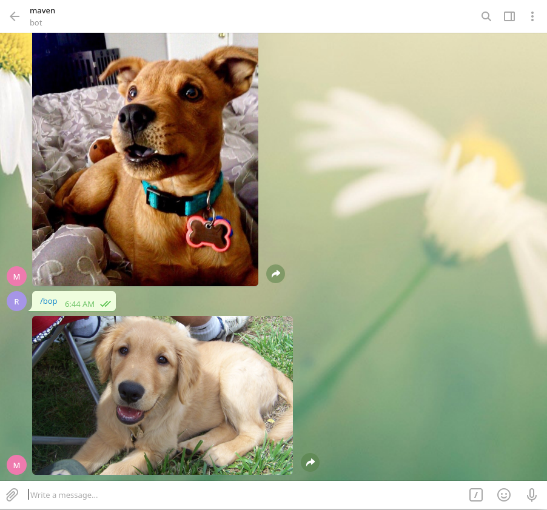

<h1 align="center">Telegram Doggo Bot<h1>
  
  ### Requirements
  You need the telegram app installed on your system to be able to test or use the given files in the repo.
  If you want to use this file for further development, first install the telegram-bot module using pip,
  
```bash
  pip3 install python-telegram-bot
```
    
### Bot Commands
    
For now there is only one command which is bop and you can use this command to get pictures of dogs just by sending `/bop` to the bot
Check it out!: http://t.me/ydoonbot
    
### Screenshot
<p align="center">
  
</p>
